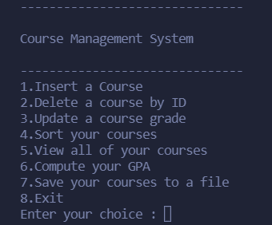

## Student Course Management System

An executable course management system for students.

### Features
- Insert, Delete, Update courses to system
- List all courses in the system
- Sort your courses in ascending order
- Compute your GPA
- Saves courses to file

Runs in POSIX-compliant environment.

### How to use
- Run main.exe

### How to compile
- g++ main.cpp -o main.exe